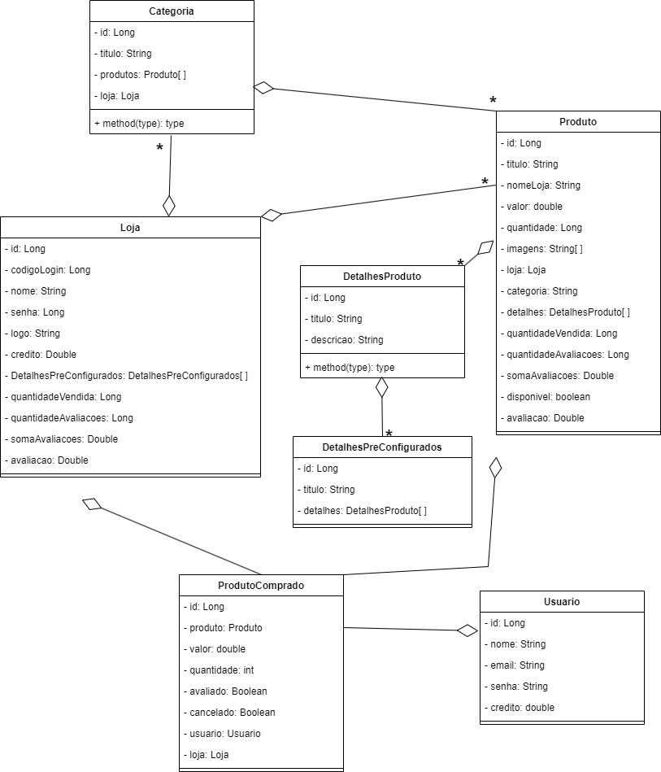

# Plataforma de ECommerce baseada na Amazon

Front-end com o framework Angular de uma plataforma de E-Commerce baseada na Amazon. Esta aplicação complementa uma API construída em Java com Spring Boot que está em outro repositório do perfil: [clique aqui!](https://github.com/YuriKevin/Spring_E-Commerce)  

## Funcionamento do sistema: 
[Assista ao vídeo](https://www.youtube.com/watch?v=-Amu7M3hCvQ)

## Outros vídeos relacionados:
[Construção do projeto em 1M](https://www.youtube.com/watch?v=npNiOJuKJeI)   
[Algoritmo que indica produtos com base no interesse do usuário](https://www.youtube.com/watch?v=GqyikTsfetY)   
[Algoritmo de responsividade](https://www.youtube.com/watch?v=VdYWJJz7kg4)   
[Timelapse construção do HTML & CSS](https://www.youtube.com/watch?v=Tjv2n7l7SxY)   

## O que este front-end faz?
- Realiza um CRUD completo com o servidor, podendo enviar solicitações para: deletar, inserir, atualizar ou requisitar informações (são mais de 70 métodos no back-end);
- Uma loja consegue personalizar sua página de perfil com seções de produtos;
- Um usuário possui um carrinho com itens da sua escolha;
- Possui um design moderno, minimalista e responsivo para mobile ou desktop;
- Possui um componente (Feedback Componente) exclusivamente dedicado à oferecer feedback para manter o usuário atualizado do que ocorre na aplicação;
- Transforma as imagens dos usuários em strings na base 64 para salvar no servidor;
- Usa recursos importantes do framework Angular, como: manipulação de rotas, uso de diretivas estruturais, uso de Observable, reutilização de um componente como filho de outros componentes e com a possibilidade de um OutPut, importação de bilbiotecas como "HTTP" e "Router", entre outras coisas;
- Confira a lista compelta de funcionalidades do back-end!

## Como utilizar?
Primeiro, abra o terminal na pasta da aplicação e digite o comando "npm install";
Depois, para utilizar esta aplicação, execute-a na porta 4200 (padrão do angular) abrindo a pasta no terminal e executando o comando "ng serve".  
Não se esqueça de executar o back-end junto! [(back-end)](https://github.com/YuriKevin/Spring_E-Commerce)

## Diagrama de Classes

### This project was generated with [Angular CLI](https://github.com/angular/angular-cli) version 16.2.1.

